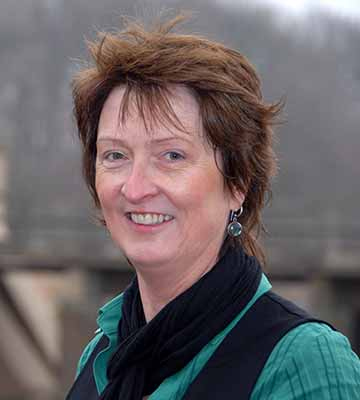

# Hallo,

mein Name ist Mary O'Keeffe und ich unterrichte Business English für Unternehmen im Umkreis von Bocholt.

Im Berufsalltag sind Englisch-Kenntnisse heutzutage unentbehrlich. Oft fehlt aber das fachspezifische Vokabular oder einfach die Sicherheit beim Sprechen.

Wir trainieren gemeinsam *Telefon- oder Verkaufsgespräche*, *Emails* schreiben, Hörverständnis und technische Vokabeln aus Ihrer Industrie. Und das alles bei Ihnen *vor Ort*; für Gruppen oder Einzelpersonen.

## Wer bin ich?

Ich bin gebürtige Irin und lebe seit 28 Jahren in Deutschland. Bereits seit 2000 unterrichte ich nebenberuflich Englisch für die VHS. In 2010 habe ich mich dazu entschieden selbstständig <a href="http://abenteuer-irland.de">Irland Reisen</a> zu organisieren und auch Business English zu unterrichten.

Seit 2010 bin ich anerkannte <a href="http://www.telc.net/">telc</a> Prüferin.

## Kontakt

Sie erreichen mich via <mok@business-english-bocholt.de> oder unter 02871 3108999.
