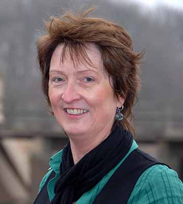

# Über mich

Mein Name ist Mary O'Keeffe. Ich bin im Süd-Westen Irlands aufgewachsen und lebe
nun seit über 25 Jahren in Deutschland.

In all diesen Jahren habe ich Berlin, Hessen und NRW meine Heimat nennen dürfen.

Ich habe bereits vor 10 Jahren angefangen Englisch für die VHS zu unterrichten.

2009 habe ich dann den Entschluss gefasst mich selbstständig zu machen und professionell Business Englisch zu unterrichten sowie [Irland Reisen zu organisieren](http://abenteuer-irland.de).

Ich bin ausgebildete [telc](ttp://www.telc.net/) Prüferin der höchsten Stufe (C2).
